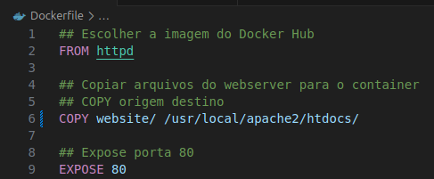

# lab-devops
Laboratório DevOps com Docker, AWS, Terraform e CI/CD

Suba uma aplicação (webserver) rodando em um container Docker em uma instância EC2 na AWS com Terraform e automatizando deploy com CI/CD via GitHub Actions

Passo 1: Criação do Dockerfile

